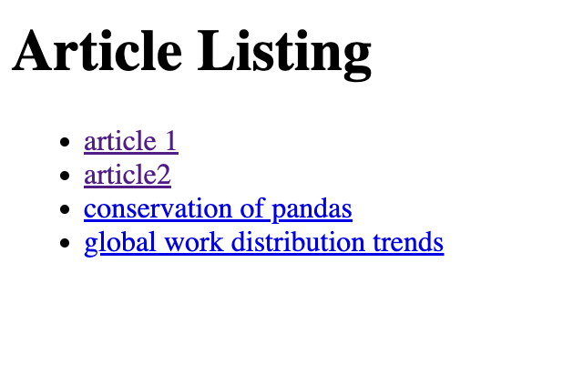

# Django URL example for namespace and urls



Loop through list of articles.
Create link to article detail.

## views.py

```python
def detail(request, id):
    item = get_object_or_404(Article, id=id)
```

## main urls.py

Set namespace.

```python
from article import views
urlpatterns = [
    path('', views.home, name='home'),
    path('article/', include('article.urls', namespace='article')),
```

## urls.py in app

set `app_name`

```python
app_name='article'

urlpatterns = [
    path('<int:id>/', views.detail, name="detail")
]

```
